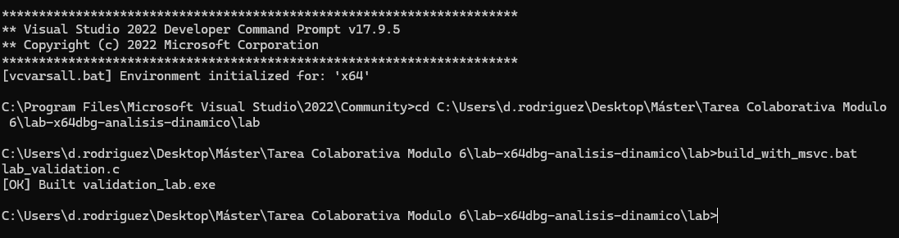
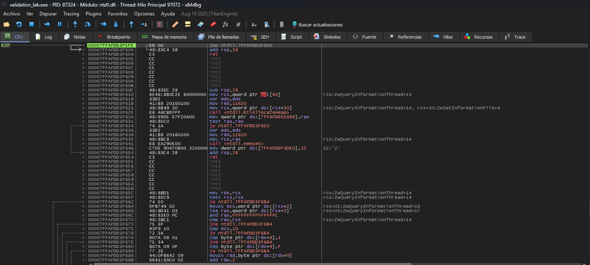
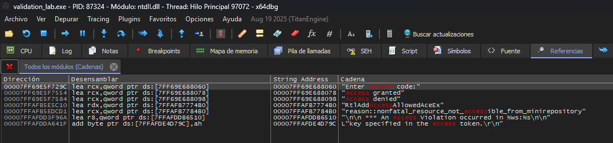
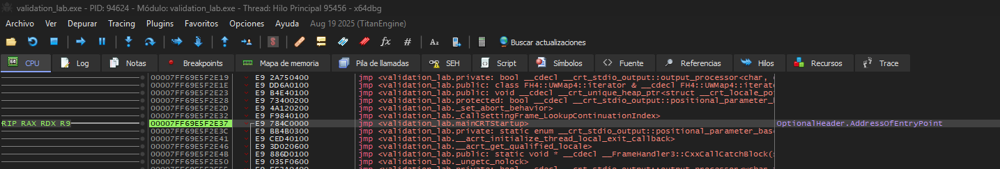
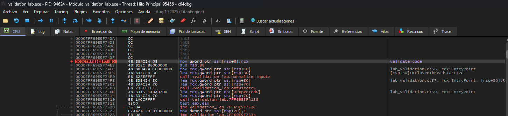
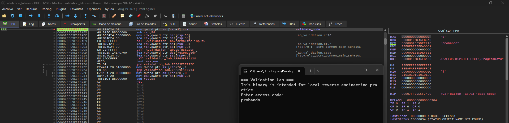
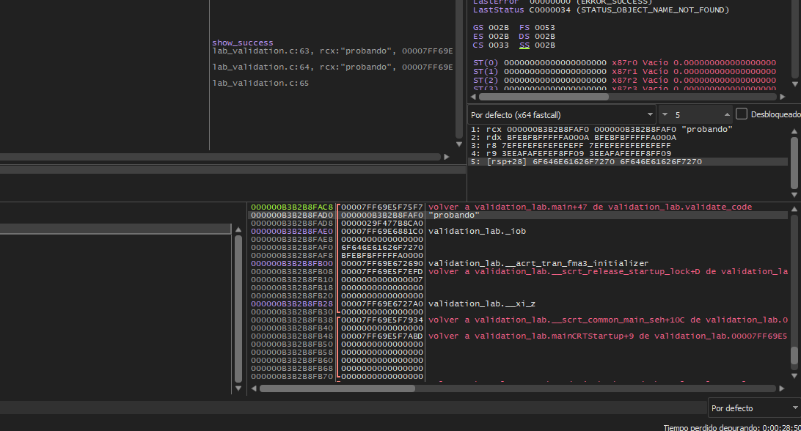
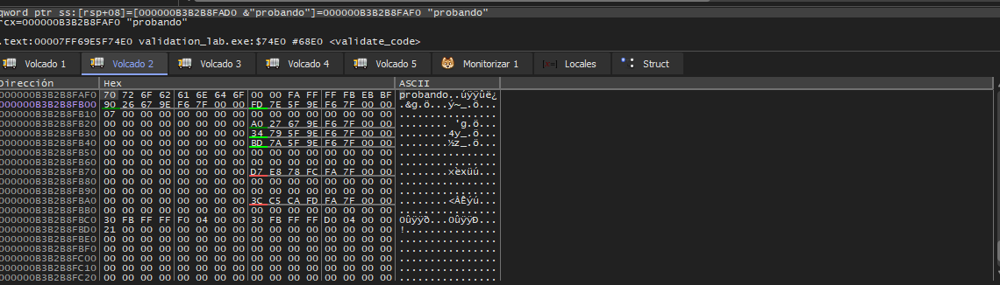
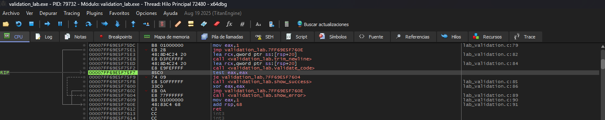
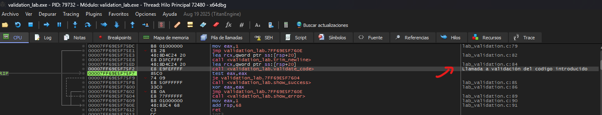

# Laboratorio de análisis dinámico con x64dbg

## Introducción a la herramienta

**x64dbg** es un depurador para Windows muy utilizado en análisis dinámico e ingeniería inversa. Su principal fortaleza es que permite al analista observar el comportamiento real de un programa mientras se está ejecutando. Esto hace posible detener la ejecución en puntos concretos, inspeccionar registros, revisar la pila, seguir punteros en memoria y entender cómo el programa toma decisiones internamente.

**x64dbg* resulta especialmente útil para comprobar:
- cómo el programa recibe la entrada del usuario,
- qué función procesa esa entrada,
- dónde aparecen los datos en memoria,
- y qué bloque de código decide entre una ruta de éxito y una de error.

---

## Objetivo

En este laboratorio se analiza un binario de práctica para Windows con **x64dbg** para observar cómo recibe una entrada, cómo la valida y cómo decide si mostrar un mensaje de éxito o de error.

El binario utilizado es `validation_lab.exe`, compilado a partir de `lab_validation.c`.

---

## Entorno y herramientas

- Windows en una máquina virtual
- x64dbg
- Binario de práctica `validation_lab.exe`
- Capturas almacenadas en la carpeta `images/`

---

## Preanálisis antes de abrir x64dbg

Antes de comenzar el análisis dinámico, conviene realizar un pequeño preanálisis del binario. Esto ayuda a llegar a la fase de depuración con una idea más clara de qué buscar.

En este laboratorio, antes de abrir x64dbg, resulta útil:
- verificar que el binario compila y se ejecuta correctamente,
- identificar si se trata de un ejecutable de consola,
- comprobar si el binario conserva símbolos,
- buscar strings visibles relacionadas con su funcionamiento,
- y revisar imports o información básica del PE.

Este preanálisis ayuda a:
- localizar más rápido la lógica de validación,
- elegir breakpoints de forma más eficaz,
- y evitar empezar el análisis completamente a ciegas.

---

## Herramientas útiles para el preanálisis

### Detect It Easy (DIE)
Resulta útil para identificar rápidamente:
- la arquitectura del ejecutable,
- el compilador utilizado,
- posible empaquetado,
- y características generales del binario.

### PE-bear
Resulta útil para revisar la estructura PE del ejecutable, incluyendo:
- imports,
- secciones,
- cabeceras,
- y metadatos básicos.

### Strings
Una herramienta de extracción de cadenas ayuda a localizar textos visibles dentro del ejecutable, por ejemplo:
- `Access denied`
- `Access granted`
- `Enter access code:`

Estas cadenas son muy útiles para identificar rutas de éxito, rutas de error y puntos de interacción con el usuario antes de abrir el depurador.

### Ghidra
Aunque no es la herramienta principal en este laboratorio, también puede resultar útil antes de depurar porque permite:
- ver la estructura general del programa,
- localizar funciones,
- revisar referencias cruzadas,
- y comprender el código de una forma más global.

En un laboratorio sencillo como este no es imprescindible, pero complementa muy bien a x64dbg.

---

## Cómo se buscan símbolos en x64dbg

Si el binario conserva símbolos, x64dbg puede mostrar nombres de funciones en la pestaña **Symbols**.

El proceso utilizado en este laboratorio es el siguiente:
1. Abrir el binario en x64dbg.
2. Ir a la pestaña `Symbols`.
3. Localizar el módulo principal del ejecutable.
4. Buscar el nombre de la función usando el filtro, por ejemplo `validate` o `validate_code`.
5. Hacer doble clic sobre la función para abrirla en la vista de desensamblado.

### Nota sobre los símbolos
Algunos binarios no conservan nombres de funciones. En esos casos, el análisis debe apoyarse más en:
- strings,
- imports,
- referencias cruzadas,
- y herramientas estáticas como Ghidra.

---

## Guía paso a paso del laboratorio

## 1. Compilar el binario

Primero, el programa del laboratorio debe compilarse con el script `build_with_msvc.bat` para generar `validation_lab.exe`.

*Figura 1. Generación del ejecutable de práctica antes de abrirlo en x64dbg.*

---

## 2. Cargar el binario en x64dbg

A continuación, se abre `validation_lab.exe` en x64dbg para comenzar el análisis dinámico.

*Figura 2. Carga inicial del ejecutable en x64dbg.*

---

## 3. Buscar strings útiles

Una vez cargado el binario, se buscan strings relevantes como `Access denied`, `Access granted` y `Enter access code:`. Esto facilita identificar las rutas de éxito y de error.

**Cómo se hace:**
1. Abrir el binario en x64dbg.
2. Hacer clic en el panel de código.
3. Clic derecho → `Search for` → `All referenced strings`.
4. Seleccionar las cadenas relacionadas con la validación.

*Figura 3. Strings útiles para orientar el análisis del flujo de validación.*

---

## 4. Ir al punto de entrada

Después, el análisis se desplaza al código de usuario del binario para localizar el punto inicial del ejecutable.

**Cómo se hace:**
1. Con el binario abierto, pulsar `Alt + F9`.
2. x64dbg ejecuta hasta llegar al código de usuario del programa.
3. Capturar el desensamblado del punto de entrada.

*Figura 4. Código inicial del ejecutable en x64dbg.*

---

## 5. Localizar la función de validación y colocar un breakpoint

A continuación, se utiliza la pestaña **Symbols** para localizar la función `validate_code`, y se coloca un breakpoint al principio para que la ejecución se detenga cuando la entrada esté a punto de validarse.

**Cómo se hace:**
1. Abrir la pestaña `Symbols`.
2. Buscar `validate_code`.
3. Hacer doble clic sobre la función.
4. Pulsar `F2` para añadir el breakpoint.

*Figura 5. Breakpoint colocado al inicio de `validate_code`.*

---

## 6. Ejecutar el programa e inspeccionar registros

Después, se ejecuta el binario, se introduce una cadena de prueba y se deja que x64dbg se detenga en el breakpoint. En ese momento se revisan los registros para ver qué datos se están utilizando durante la validación.

**Entrada utilizada en la prueba:** `probando`

**Cómo se hace:**
1. Con el breakpoint activo, pulsar `F9`.
2. En la consola, escribir `probando` o cualquier otra cadena de prueba y pulsar `Enter`.
3. x64dbg se detiene en `validate_code`.
4. Revisar el panel de registros.

*Figura 6. Vista de registros cuando la ejecución se detiene dentro de la función de validación.*

---

## 7. Inspeccionar la pila

En el mismo punto de parada, se revisa la pila para observar el contexto de la llamada y las direcciones de retorno.

**Cómo se hace:**
1. Mantener el programa detenido en `validate_code`.
2. Localizar la ventana de la pila en la parte inferior derecha.
3. Capturar la vista del código junto con la pila.

*Figura 7. Inspección de la pila durante la ejecución de `validate_code`.*

---

## 8. Seguir el buffer del usuario en memoria

A continuación, se sigue el puntero que referencia la entrada del usuario y se abre esa dirección en la ventana de dump para ver la cadena directamente en memoria.

**Cómo se hace:**
1. Observar que `RCX` apunta a la cadena introducida.
2. Hacer clic derecho sobre `RCX`.
3. Elegir `Follow in Dump`.
4. Localizar la cadena en la ventana de dump.

*Figura 8. Dump de memoria donde se puede observar la entrada del usuario dentro del proceso.*

---

## 9. Localizar la comparación y el salto condicional

Después, la ejecución vuelve desde `validate_code` a `main`, y se captura el bloque donde el programa comprueba el valor devuelto y decide si tomar la ruta de éxito o la de error.

**Cómo se hace:**
1. Estando dentro de `validate_code`, pulsar `Ctrl + F9` para volver al llamador.
2. Avanzar con `F8` hasta que aparezca la comprobación del resultado.
3. Capturar el bloque que contiene la comparación y el salto condicional.

*Figura 9. Bloque de decisión que dirige la ejecución hacia la ruta de éxito o la ruta de error.*

---

## 10. Añadir comentarios para documentar el análisis

Por último, se pueden añadir comentarios dentro de x64dbg sobre el bloque de decisión. Esto hace que el análisis sea más fácil de entender y de retomar más adelante.

**Cómo se hace:**
1. Volver al bloque de comparación y salto.
2. Hacer clic derecho sobre la instrucción.
3. Añadir un comentario explicando qué hace ese bloque.
4. Capturar la vista anotada.

*Figura 10. Comentarios añadidos en x64dbg para documentar el bloque de decisión.*

---

## Qué se observó en el laboratorio

Con este flujo de trabajo, ha sido posible comprobar que:
- el programa recibe una cadena desde la consola,
- la función `validate_code` procesa esa entrada,
- la cadena del usuario aparece en memoria,
- y el resultado de la validación se utiliza después en un bloque con comparación y salto condicional.

---

## Aspectos más útiles de x64dbg en este caso

En este laboratorio, x64dbg ha resultado especialmente útil para:
- colocar breakpoints en funciones concretas,
- ver registros y pila en tiempo real,
- seguir punteros hasta memoria,
- y localizar el punto exacto en el que el programa decide entre éxito y error.

---

## Limitaciones

Aunque x64dbg es muy útil, este laboratorio también muestra que:
- no ofrece una visión global tan cómoda como una herramienta estática,
- obliga al analista a avanzar paso a paso si el flujo no está claro,
- y funciona mejor cuando ya existe una hipótesis inicial obtenida durante el preanálisis.

---

## Resumen rápido del proceso seguido

1. Compilar el binario.
2. Abrirlo en x64dbg.
3. Buscar strings relevantes.
4. Ir al punto de entrada.
5. Buscar símbolos y localizar `validate_code`.
6. Colocar un breakpoint en la función.
7. Ejecutar el programa con una entrada de prueba.
8. Revisar registros, pila y dump.
9. Localizar el bloque de comparación y salto condicional.
10. Añadir comentarios para documentar el análisis.